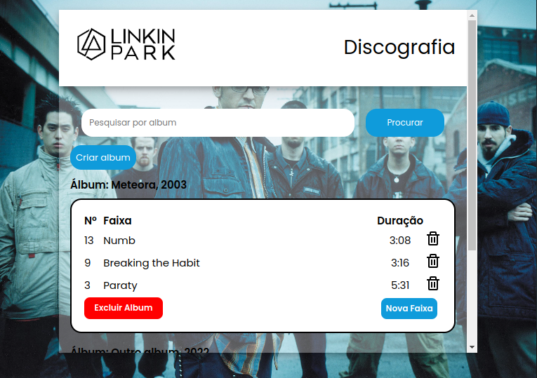

<h1>Discografia Linkin Park</h1>

Uma aplicação web feita com Laravel, PHP, Html, Css e PostgreSQL. O objetivo da aplicação é gravar (Crud) Albums e musicas da banda Linkin Park. Além do Crud esse projeto possui um relacionamento One to many. Um album pode ter várias musicas.

Veja o projeto online no Heroku aqui: https://dry-anchorage-29803.herokuapp.com/

